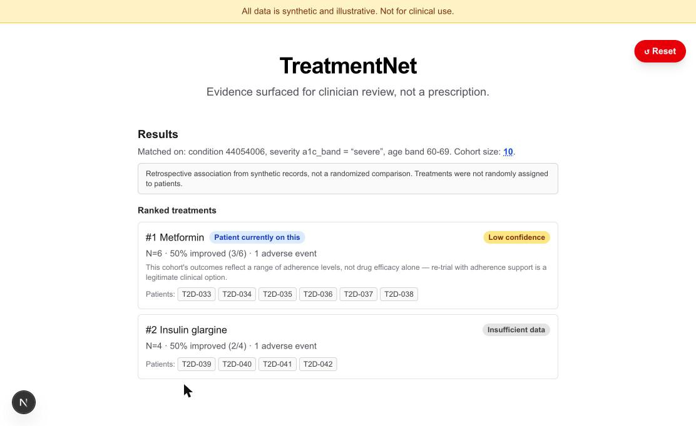

# TreatNet

A clinician-facing tool that surfaces retrospective treatment outcomes for a patient case, deterministically matched and ranked — with hard contraindication gating, confidence tiers driven by real sample size, and every number traceable back to the synthetic records it was computed from.

Built in one hackathon stretch. **All patient data is synthetic and illustrative — this is not a clinical tool, and no output should ever inform real patient care.**



## What it does

1. A clinician pastes a messy, unstructured clinical note (or loads one of four pre-loaded demo notes).
2. Claude extracts structured fields — condition, severity, age, observations, allergies, treatment history — each with its own confidence level (`high` / `medium` / `low`). Nothing downstream runs until the clinician reviews and confirms this draft.
3. The confirmed case is matched against a synthetic patient cohort: same condition, same severity band, same age band — never all-comers. Any treatment contraindicated by the patient's own allergies or lab values is removed before ranking, via a deterministic gate.
4. Remaining treatments are ranked by outcome success rate, each carrying an N, a confidence tier, and a citation into the exact synthetic patient records behind the number.
5. If even the best-matched cohort falls below a minimum sample size, the tool refuses to rank rather than show a confident-looking result it can't back up.

See [DEMO.md](DEMO.md) for a full walkthrough of all four demo cases with exact expected output.

## Architecture

- **Next.js (App Router, TypeScript, Tailwind) on Vercel** — one deployable unit: UI plus serverless API routes.
- **Supabase Postgres**, FHIR-resource-aligned schema (patients, conditions, observations, allergies, treatments, outcomes, contraindication rules). Accessed only from server-side API routes via the service-role key — row-level security is enabled with no policies, so the key that could ever reach the browser (the anon key) cannot read or write any of this data, even by mistake.
- **Anthropic Claude**, called from exactly one place: `/api/extract`, which turns unstructured prose into a structured, confidence-scored draft case. Claude never sees the database and never decides a gate, a cohort, a statistic, or a ranking.

| Decision | Owner | Why |
|---|---|---|
| Contraindication gating | Deterministic TypeScript (`lib/gates.ts`) | Safety-critical. A hallucinated gate would look like the tool endorsing a dangerous treatment. |
| Cohort matching / severity stratification | Deterministic TypeScript (`lib/matching.ts`) | Same case + same DB state must always produce the same cohort — reproducible, and readable as code, not trusted from a prompt. |
| Outcome statistics, ranking | Deterministic aggregation | Exactly the kind of arithmetic an LLM quietly gets wrong under paraphrase, and the first thing a clinician judge will challenge. |
| Free-text → structured case extraction | Claude, per-field confidence, human-confirmed before use | The one task in this product an LLM can do that deterministic code can't. Still never trusted silently. |

### Confidence tiers (fixed thresholds)
- **N < 5** — insufficient data, no ranking shown (gates still apply — they don't depend on cohort size).
- **5 ≤ N < 15** — low confidence.
- **N ≥ 15** — moderate confidence. The tool never claims "high confidence" anywhere; this is synthetic data at hackathon scale, not a validated model.

### On confounding-by-indication

We cannot statistically adjust for confounding with synthetic data and no clinical vetting — claiming otherwise would be the actual credibility failure here. Two honest mitigations, both visible on every results screen:

1. **Severity-band stratification is mandatory, not optional** — the matched cohort is always same-condition *and* same-severity-band before any outcome is compared, shown explicitly as "Matched on: ...".
2. A persistent callout on every results screen:
   > Retrospective association from synthetic records, not a randomized comparison. Treatments were not randomly assigned to patients.

### Provenance, everywhere

Every number on a results screen is a citation, not an assertion:
- Each ranked treatment's patient chips open the exact synthetic record backing that row.
- Each gated ("avoid") treatment links to the specific contraindication rule that fired.
- "Cohort size" itself opens the full, independently re-derived list of matched patient records — including for the refusal state, where no ranking is shown at all.

## Non-goals

Explicitly out of scope for this build: real EHR integration, Synthea-generated data, authentication/multi-tenancy, HIPAA/GDPR compliance, vector databases, model fine-tuning, and any narrative/summary layer beyond the raw ranked numbers. This is a demo of a deterministic matching engine with LLM-assisted intake — not a product.

## Running locally

```bash
npm install
cp .env.example .env.local   # fill in your own Anthropic + Supabase credentials
npm run dev
```

Open [http://localhost:3000](http://localhost:3000). `.env.local` is gitignored and must never be committed — `.env.example` holds placeholders only.

Database schema and seed data live in `supabase/migrations/` and `seed/`; see comments there for the Supabase CLI commands used to apply them (`supabase db push`, `supabase db query --linked --file`).

## Repo hygiene

- No secrets have ever been committed to this repository's history (verified against `.env.local` specifically, and against `SUPABASE_SERVICE_ROLE_KEY` / Anthropic key patterns generally).
- `.gitignore` excludes all `.env*` files except `.env.example`.
- This repository is public.
